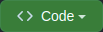
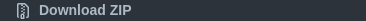
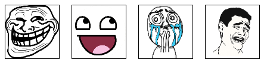

<div align=center>
  <h1>Meme Generator</h1>
  <p>Create your own meme and have fun customizing it</p>

  
  
  

  [Project Web Page](https://fabio-vicente.github.io/Meme-Generator/)

  <details>
    <summary>
      <strong>See a screenshot</strong>
    </summary>
    <br />
    
  </details>
</div>
  
</div>
<br />

## About

Create a meme by uploading a photo, or select a pre-existent image, and customize it at will.

This project development is part of [Trybe](https://www.betrybe.com/) course program.

### Development Skills

- HTML;
- CSS;
- Javascript;
- DOM;
- Events.

<br />

## Getting Started

### Prerequisites

  - Web Browser compatible with HTML5, CSS3 and EcmaScript 6.

### Instalation

  Use one of these three ways to install the project locally.

#### 1. Download ZIP:
>
>  - Click on the `Code` green button at repository top;
>
>      
>
>  - Click on `Download ZIP` button;
>
>      
>  
>  - Unzip files in a choosen directory;

#### 2. Clone repository via HTTPS:
>
>  - Use `https://github.com/Fabio-Vicente/Meme-Generator.git` endpoint for clonning via HTTPS (credencials may be needed);


#### 3. Clone repository via SSH:
>
>  - Use `git@github.com:Fabio-Vicente/Meme-Generator.git` endpoint for clonning via SSH (it must be need set a SSH Key);

### Initialization

Once you have procedure on the [installation process](#instalation), open the [index.html](index.html) downloaded file on your browser to start use the program.

**Don't want to install the project locally?** No worries! You can acess the web project by this link:

> https://fabio-vicente.github.io/Meme-Generator/

<br />

## Usage

For starting, you need to choose if you want to create your meme using a personal photo, or using a pre-existent image. For the first choice, click on the <span></span> button, and upload your photo. Otherwise, just click on one of the images found below.

<br />

<div align=center>

  
  ###### Pre-existent images
  
</div>

<br />

Type on the screen input the text you want to be visible on meme, and choose one of available frames. Now you have your custom meme. Have fun!

<br />

## Lint

The project was staticly tested using [ESLint](https://eslint.org/) and [StyleLint](https://stylelint.io/), whose appoints no error on code analyses. These tools enforces code readbility and standart development style such on CSS (StyleLint) as on Javascript coding (ESLint).

#### Check ESLint

You can verify [ESLint](https://eslint.org/) rules attendance running following command:

```sh
  npm run lint
```

#### Check StyleLint

You can verify [StyleLint](https://stylelint.io/) rules attendance running following command:

```sh
  npm run lint:styles
```

<br />

For both analyzis, you must have `NPM >= 8.1.0` previously installed, and have been installed project dependencies by running command:

```sh
  npm install
```

###### Obs: you'll probably have no response on your analyzis. It occurs whenever is found no errors on the code styling. Try to make some mess 💩 on formatting and run this command again. Now you must see some errors pointed in your terminal.

<br />

## Authors & contributors

The development of this project, as well all documentation, was made by [Fábio Vicente(Me)](https://github.com/Fabio-Vicente).

<br />

## Acknowledgements

- [Trybe](https://www.betrybe.com/) by porpose this project, specify requirements and provide a initial configuration;
- [Amazing Github Template](https://github.com/dec0dOS/amazing-github-template) which provides a Readme Template for inspiration.

<br />
<br />
<br />
<br />

<div align=right>

[](https://github.com/Fabio-Vicente)

</div>

